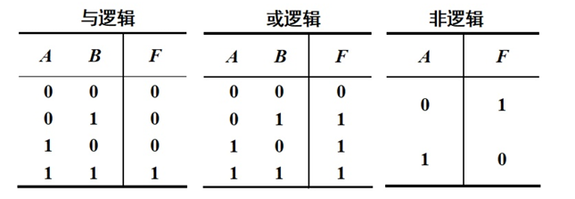
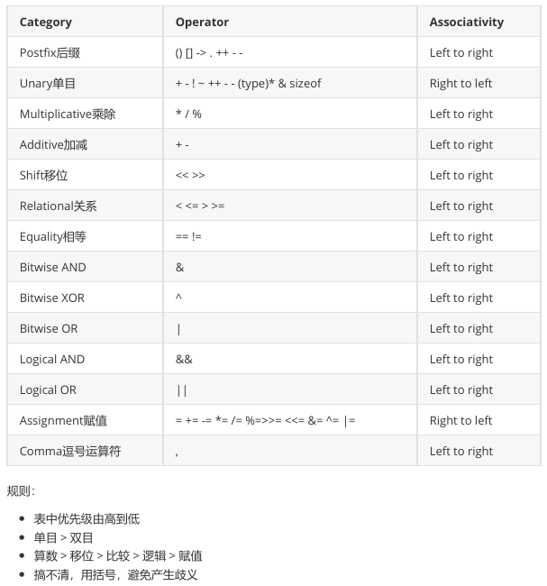

# 基础语法

## 1.注释

- // 单行注释
- /_ 多行注释 _/

```powershell
// TODO: 将来完成 【可以在vscode里安装一个Todo Tree插件管理代码】
// NOTE: 请注意
// Deprecated: 告知已经过期, 建议不要使用。未来某个版本可能移除
```

## 2.分割

> 在 Go 语言中把行分隔符作为一条语句的结尾。也就是说,一般情况下,一行结束。

## 3.命名规范

- 标识符采用 CamelCase 驼峰命名法
  - 如果只在包内可用,就采用小驼峰命名
  - 如果要在包外可见,就采用大驼峰命名
- 简单循环变量可以使用 i、j、k、v 等
- 条件变量、循环变量可以是单个字母或单个单词,Go 倾向于使用单个字母。Go 建议使用更短小。
- 常量使用驼峰命名
- 函数/方法的参数、返回值应是单个单词或单个字母
- 函数可以是多个单词命名,包名应该和导入路径的最后一段路径保持一致
- 接口优先采用单个单词命名,一般加 er 后缀。Go 语言推荐尽量定义小接口,接口也可以组合

## 4.关键字

[文档地址]: https://golang.google.cn/ref/spec

```
break        default      func         interface    select
case         defer        go           map          struct
chan         else         goto         package      switch
const        fallthrough  if           range        type
continue     for          import       return       var
```

## 5.预定义标识符

[文档地址]: https://golang.google.cn/ref/spec#Predeclared_identifiers

```
Types:
	any bool byte comparable complex64 complex128 error float32 float64 int int8 int16 int32 int64 rune string uint uint8 uint16 uint32 uint64 uintptr

Constants:
	true false iota

Zero value:
	nil

Functions:
	append cap close complex copy delete imag len make new panic print println real recover
```

## 6.标识符

- 一个名字,本质上是个字符串,用来指代一个值
- 只能是大小写字母、数字、下划线,也可以是 Unicode 字符
- 不能以数字开头
- 不能是 Go 语言的关键字
- 尽量不要使用"预定义标识符",否则后果难料
- 大小写敏感

### 6.1 标识符建议：

- 不要使用中文
- 非必要不要使用拼音
- 尽量遵守上面的命名规范，或形成一套行之有效的命名规则

## 7.字面常量

它是值,不是标识符,但本身就是常量,不能被修改

Go 语言中,boolean、rune、integer、float、complex、string 都是字面常量。其中 rune、integer、float、complex 常量被称为数值常量

```
"abc"
'a'
true
1
3.14
```

```go
// 在go中整数字面量默认是int
var a = 13 // int类型
```

> 无类型常量的缺省类型为 bool、rune、int、float64、complex128 或字符串

## 8.常量

> 常量: 使用 const 定义一个标识符,它对应的值不允许修改

对常量并不要求全大写加下划线的命名规则

> 注意: 常量必须定义时赋值,否则报错

```go
const a int = 100 // 指定类型定义常量并赋值
// 定义多个常量
const (
  b = "abc"  // 定义常量,等式左边并未给出类型,将进行类型推导
  c = 12.3
  d = 'T'
)
const e // 错误, const定义常量,必须在定义时赋值,并且之后不能改变
const c = [2]int{1, 2} // 错误, 数组的容器内容会变化,不能在编译期间明确的确定下来, 所以不能使用const，应该使用var
```

> 注意：Go 语言的常量定义，必须是能在编译器就要完全确定其值，所以，值只能使用字面常量。

### 8.1 iota

```go
// 单独写iota都是从0开始
const a = iota // 0
const b = iota // 0
```

```go
// 批量写iota从0开始, iota是行索引,在第一行不管有几个iota都是0
const (
  SUN = iota // 0
  MON = iota // 1
  TUE = iota // 2
)
// 简化
const (
  SUN = iota
  MON
  TUE
)
```

```go
// 批量写iota从0开始,即使第一行没有写iota,iota也从第一行开始,从0开始增加
const (
  a = iota // 0
  b // 1 下一行没有赋值的话,那么会继承自上一行,相当于b = iota 等于1
  c // 2
  _ // 3
  d = 10 // 10
  e // 10
  g = iota // 6, iota从第一行为0开始算, 每一行加1
  h // 7
)
```

```go
const (
    a = (iota + 1) * (iota + 1) // 1 iota批量定义时是行索引,不管几个iota都是0
    b // 4
    c // 9
    d // 16
)
```

## 9.变量赋值

变量: 赋值后,可以改变值的标识符。

```go
var n1 // 错误, 如果不赋值,编译器无法推测类型
var n2 int // 正确, 只声明,编译器会自动给n2赋初始值
var a = 100 // 类型推导为int
var b:float64 = 3.25 // 直接指定类型
b = 5.1 // 错误, b多次声明
// 批量变量定义用 var ()
var (
  c = true // 类型推导
  d = 123
  w int = 333
)
// 或者
var e, f int // 如果要写在一行,必须同类型,只需要在最后指定类型就行
var g, h int = 100, 120 // 定义同一行并且赋值【必须两个都赋值】
var q = nil // 错误 非法,nil不允许这样用
```

```go
// 短格式 注意: 短格式不能定义在全局中
// _ 空白标识符,或称为匿名变量
func main() {
    a := 100
    b, c := 200, "xyz"
    // 交换
    d := 300
    e := 500
    e, d = d, e // e: 300 d: 500 可以理解为等号右侧先执行, 那么d指向了300 e指向了500【这里可以理解为照相的快照定格了(拿到了d和e的内存地址, 拷贝了一份)】, 再执行左侧, e指向了300 d指向了500
    // _ 空白标识符, 只能用于左边, 其他地方不可以用【只是一个占位符】
    f, _ , h := 100, 200, 300
    u, _, o = func()(int, string, bool) { return 300, "ok", true }() // 函数执行后将返回的三个值赋给u, _, o
}
```

### 9.1 下划线

> \_下划线是空白标识符

- 下划线和其他标识符使用方式一样,但它不会分配内存,不占名词空间
- 为匿名变量赋值,其值会被抛弃,因此后续代码中不能使用匿名变量的值,也不能使用匿名变量为其他变量赋值

### 9.2 短格式

- 使用:=定义变量并立即初始化
- 只能用在函数中,不能用来定义全局变量
- 不能提供数据类型,由编译器来推导

### 9.3 零值

变量已经被声明,但是未被显式初始化,这是变量将会被设置为零值。

- int: 0
- float: 0.0
- bool: false
- string: ""
- 指针: nil

### 9.4 标识符本质

每一个标识符对应一个具有数据结构的值,但是这个值不方便直接访问,程序员就可以通过其对应的标识符来访问数据,标识符就是一个指代。

- 标识符源代码时候,用来指代某个值的。编译后还有变量、常量标识符码?
  - 答: 没有了,因为数据在内存中,内存访问靠什么? **地址**,标识符编译后就没有了换成了地址
- 编译会生成二进制可执行文件并执行,在内存中开启进程,进程内有你定义的数据

## 10.变量可见性

### 10.1 包级标识符

在 Go 语言中,在.go 文件中的顶层代码中,定义的标识符称为包级标识符。如果首字母大写,可在包外包内可见。如果首字母小写,则包内可见。

> 同一个目录就是同一个包,同一个目录里面只能有一个包

```go
// 例如: 在ch1文件夹下有main.go 和 a.go, 那么它们俩文件内部只能定义同一个package 包名
package main
import "fmt" // 导入包或第三方包
var d = "abc" // 顶层代码, 包内的全局变量， 包内可见
var E = "xyz" // 包内全局可见, 包外也可以; 可以导出,可以外漏到包外
func main() { // main函数叫做入口函数,go约定main函数必须在main包中定义
    // Println 包外可见
    fmt.Println(d)
}
```

**使用建议**

- 顶层代码中定义包级标识符
  - 首字母大写作为包导出标识符,首字母小写作为包内可见标识符
  - const 定义包级常量,必须在声明时初始化
  - var 定义包级变量
    - 可以指定类型,也可以使用无类型常量定义
    - 延迟赋值必须指定类型,不然无法确定零值
- 有相关关系的,可以批量定义在一起
- 一般声明时,还是考虑"就近原则",尽量靠近第一次使用的地方声明
- 不能使用短格式定义

### 10.2 局部标识符

定义在函数中,包括 main 函数,这些标识符就是局部标识符

使用建议

- 在函数中定义的标识符
- const 定义局部常量
- var 定义局部变量
  - 可以指定类型,也可以使用无类型常量定义
  - 延迟赋值必须指定类型,不然无法确定零值
- 有相关关系的,可以批量定义在一起
- 在函数内,直接赋值的变量多采用短格式定义

## 11.类型

### 11.1 布尔型

类型 bool,定义了 2 个预定义常量,分别是 true、false

### 11.2 数值型

[数值型]: https://golang.google.cn/ref/spec#Numeric_types

复数: complex64、complex128

#### 11.2.1 整数

- 长度不同【有符号】: int8、int16(C 语言 short)、int32、int64(C 语言 long)
  - 最高位是符号位
  - rune 类型本质上就是 int32; type rune = int32 类型 别名 type 定义时使用了 =,
- 长度不同无符号【有符号】: uint8、uint16、uint32、uint64
  - u 即 unsigned,最高位不是符号位
  - byte 类型,它是 uint8 的别名
- 自动匹配平台: int、uint
  - int 类型它至少占用 32 位,但一定注意它不等同于 int32,不是 int32 的别名。要看 CPU,32 位就是 4 字节,64 位就是 8 字节。但是,也不是说 int 是 8 字节 64 位,就等同于 int64,它们依然是不同类型

**扩展知识**

计算机内部是使用二进制的，也就是只有 0 和 1，那如何表达出正负数的区别呢？（为了让初学者便于理 解，不引入补码表示法） 为了方便以单字节为例，1 个字节是 8 位，那么可以表示 256 种状态。 如何表示十进制 2 呢？它是 00000010。那十进制-2，如何表示？ 那就把最高位单独解释，最高位定为符号位，0 表示正号，1 表示负号。-2 用二进制表示为 10000010

**进制表示**

- 十六进制: 0x10、0X10
- 八进制： 0o10、0O10
- 二进制: 0b10、0B10

> 与其他语言不同,即使同是整型这个大类中,在 Go 中,也不能跨类型计算。如有必要,请强制类型转换。
>
> 强制类型转换: 把一个值从一个类型强制转换到另一种类型,有可能转换失败。

```go
// 强制类型转换又称显式类型转换
a := 10 // 默认是int类型
var b int64 = 300
var c int64 = int64(a) + b
```

```go
// 十进制 2
// 第一位表示符号 0为正 1为负
0	000 0010
// 十进制 -2  【补码】符号位不动,其余位按位取反,最后加1
1   000 0010
// 因为-2要补码, 下面是结果
1   111 1101  + 1
// =>
1   111 1110
// 上面为啥要补码, 因为为了把减法当作加法做
```

```go
// 扩展知识
package main
import "fmt"
func main() {
    var a = 100
    var b = 200
    // Printf 向控制台打印, f是format %T是占位符,%T表示type,取值的类型
    fmt.Printf("%T %T %T\n", a, b, a + b)
    // %d 占位符 digital 数值形式,往往用于整数
    fmt.Printfln("%d", a)
    // %s 占位符 string类型的值; %q 占位符 带字符串类型引号的%s  q表示 quote引号的意思
    fmt.Printfln("%s %q", string(50), string(50)) // 2 "2" string(整数值看作是ASCII或UniCode码)
    var m int64 = 50
    // [2] => string(m), [1] => rune(m)
    fmt.Printfln("%[2]T %[1]d", rune(m), string(m)) // 值从1开始编 rune(m)表示索引1, string(m)表示索引2
    fmt.Printfln("%d, %[1]d, %d", 100, 200, 300) // 输出 100 100 200 因为第三个%d没有指定索引,所以将第二个索引+1
    var a1 = '测' // rune 类型 本质是int32
    // %c 占位符 character 字符输出
    fmt.Printf("%T %d %c", a1) // 内存中一个数据,看你赋予它什么类型,就可以看到不同的东西
    a1 = 'c' // 重新赋值,类型不变
    a = 0x63 // 重新赋值, 0x63是整数标识符  0x63是字面常量,默认是int类型, 隐式类型转换
    // 相当于 a = (int32)0x63
    a = '\x63' // \x是指16进制字符表示法

    var aa = '测' // rune类型 unicode编码
    var bb = "测" // string类型 utf-8类型,内存中使用utf-8编码保存字符串的字符
}
```

```go
type myint int32 // 特别注意这里没有等号=, 这不是别名,它是新类型,新和旧类型不是同一个类型【本质上是一样,但是定义的数据不能直接通用】
type myint64 = int64 // 类型别名
```

> 可以认为 go 中没有字符类型,本质上是 int32 的别名,习惯上称 rune 为字符类型
>
> 在 go 中隐式类型转换,只限于 untyped constant 无类型字面量

```go
// 字符
var s = '测' // 字符类型 unicode码, 本质上rune(int32) 用了2个字节就行了,但是s本身就得用4个字节
```

#### 11.2.2 浮点数

- float32: 最大范围约为 3.4e38, 通过 math.MaxFloat32 查看
- float64: 最大范围约为 1.8e308, 通过 math.MaxFloat64 查看
- 打印格式化符常用%f

```go
package main
import "fmt"
func main() {
	var a = 1000.2486
    fmt.Printf("%f\n", a) // %f占位符 浮点数输出
    fmt.Printf("%.2f\n", a) // 保留两位小数输出
    fmt.Printf("%10f\n", a) // 打印宽度为10【a的长度为9, 前面会空出一个空格来】, 默认右对齐
    fmt.Printf("%10.2f\n", a) // 打印宽度为10,保留2位小数
    fmt.Printf("%-10.1f】\n", a) // 打印宽度为10,保留1位小数,左对齐
    fmt.Printf("%T, %.2[1]f", a) // 打印a的类型, 保留2位小数 右对齐
}
```

#### 11.2.3 进制及转换

常见进制有二进制、八进制、十进制、十六进制。

```go
// 每8位(bit)位1个字节(byte)
// 一个字节能够表示的整数的范围:
// 无符号数: 0 ~ 0xFF, 即0到255, 256种状态
// 有符号数: 依然是256种状态, 去掉最高位还剩7位,能够描述的最大正整数为127,那么负数最大就为-128。
```

二进制转八进制、十六进制

```go
// 0b1110 计算为 1 * 2^3 + 1 * 2^2 + 1 * 2^1 + 0 * 2^0 = 14
// 0o664 计算为 6 * 8^2 + 6 * 8^1 + 4 * 8^0 = 436
// 0x41 计算为 4 * 16^1 + 1 * 16^0 = 65
```

```go
// 这里利用 8421法来方便计算
// 二进制转十六进制, 二进制每4位断开转换
// 0b1111 1001 => 0bF9    相当于  1111 => 8 + 4 + 2 + 1 => F; 1001 => 8 + 0 + 0 + 1 => 9
// 二进制转八进制, 二进制每3位断开转换
// 0b11 111 001 => 0o371 相当于 11 => 2 + 1 => 3; 111 => 4 + 2 + 1 => 7; 001 => 0 + 0 + 1 => 1
```

八进制、十六进制转二进制

```go
// 八进制转二进制
// 0o664 => 0b110 110 100
// 十六进制转二进制
// 0xF8 => 0b1111 1000
```

十进制转二进制、十六进制

```go
// 十进制转二进制
// 127除以基数2,直到商为0为止,反向提取余数
// 十进制转十六进制
// 127除以基数16,直到商为0为止,反向提取余数
```

#### 11.2.4 转移字符

每一个都是一个字符,rune 类型。可以作为单独字符使用。也可以作为字符串中的一个字符

```go
 \a   U+0007 alert or bell
 \b   U+0008 backspace
 \f   U+000C form feed
 \n   U+000A line feed or newline
 \r   U+000D carriage return
 \t   U+0009 horizontal tab
 \v   U+000B vertical tab
 \\   U+005C backslash
 \'   U+0027 single quote  (valid escape only within rune literals)
 \"   U+0022 double quote  (valid escape only within string literals)
```

单引号留给表示字符,字面量表达,本质上是 int32(rune)或 byte(uint8)

### 11.3 字符串

使用双引号或反引号引起来的任意个字符,它是字面常量。

> 注意: 在反引号``中使用\t 等转义字符失效

> 用途: 一般用于多行书写, 结构体 tag 使用

字符串或字符中,占用的字节数(内存占用或磁盘占用),显示中在不同的显示设备中展示的显示宽度

```go
a := `a	b
c`
// 下面等同于上面,转移字符在反引号中失效【反引号不支持转义字符】
b :="a\tb\nc"
```

#### 11.3.1 字符串格式化

> 格式符参考 fmt 包帮助 https://pkg.go.dev/fmt

- %v 适合所有类型数据,调用数据的缺省打印格式
  - %v 对于结构体,会多打印出字段名
- %#v 对于结构体,有更加详细的输出
- %T 打印值的类型
- %% 打印百分号本身

##### 11.3.1.1 整数

- %b 二进制; %o 八进制; %O 八进制带 0o 前缀;%x 十六进制小写;%X 十六进制大写
- %U 把一个整数用 Unicode 格式打印。
  - 例如: fmt.Printf("%U, %x, %c\n", 27979, 27979, 27979) => U+6D4B, 6d4b, 测
- %c 把 rune、byte 的整型值用字符形式打印
- %q 把一个整型当作 Unicode 字符输出,类似%c,不过在字符外面多了单引号。q 的意思是 quote

##### 11.3.1.2 浮点数

- %e、%E 科学计数法
- %f、%F 小鼠表示法, 最常用
- %g 内部选择使用%e 还是%f 以简洁输出;%G 选择%E 或%F

##### 11.3.1.3 字符串或字节切片

- %s 字符串输出,如果是 rune 切片,需要 string 强制类型转换
- %q 类似%s,外部加上双引号。q 的意思就是 quote

#### 11.3.1.4 指针

- %p 十六进制地址

| 类型                            | 说明        | 缺省格式符               | 常用格式符 |
| ------------------------------- | ----------- | ------------------------ | ---------- |
| bool                            | 布尔型      | %t                       | %t         |
| int/int8/int16/int32/int64      | 整型        | %d                       | %d、%b、%x |
| uint/uint8/uint16/uint32/uint64 | 无符号整型  | %d,如果使用%#v 就等同%#x | %d、%b、%x |
| float32/float64                 | 浮点型      | %g                       | %f、%e     |
| complex64/complex128            | 复数        | %g                       |            |
| byte                            | 字节型      | %c                       | %c、%d     |
| rune                            | 字符型      | %c                       | %c、%d     |
| uintptr                         | 指针        | %p                       | %p         |
| string/[]byte                   | 字符串      | %s                       | %s         |
| map slice channel error         | 引用        | %v                       |            |
| slice                           | 索引 0 元素 | %p                       |            |

#### 11.3.1.5 特殊格式符写法

```go
a, b, c, d := 100, 200, 300, 400
fmt.Printf("%d, %[2]v, %[1]d, %d", a, b, c, d)
```

可以认为中括号内写的是索引，是 Printf 的索引，索引 0 是格式字符串本身，1 开始才是参数。如果写了 [n]，之后默认就是 n+1

#### 11.3.1.6 输出函数

输出到标准输出

- Print：使用缺省格式输出,空格分隔
- Println: 使用缺省格式输出,空格分隔,最后追加换行
- Printf: 按照指定的格式符输出

输出到字符串,经常用来拼接字符串用

- Sprint: 相当于 Print,不过输出为 string, 返回值为 string
- Sprintln: 相当于 Println, 不过输出为 string
- Sprintf: 相当于 Printf, 不过输出为 string

## 12.操作符

参考 https://golang.google.cn/ref/spec#Operators_and_punctuation

### 12.1 逻辑运算真值表



### 12.2 算术运算符

+、-、\*、/、%、++、--

- 5/2、 -5/2
- +、-还可以当作正负用,就不是算术运算符了,例如-s
- 类 C 语言语法没有 Python

++、--只能是 i++、i--，且是语句,不是表达式。也就是说,语句不能放到等式、函数参数等地方。

```go
a := 10
fmt.Println(a++) // 错误, ++、--不能用于参数中
```

> 注意: 没有++i、--i

### 12.3 常量计算问题

常量分类 typed 类型化常量和 untyped 常量

```go
var a int = 1
var b float32 = 2.3
// fmt.Println(a * b) // 错误, int和float32类型不同,无法计算,除非强制类型转换
fmt.Println(float32(a) * b)

var a1 = 1 // int
var b1 = 2.3 // float64
// fmt.Println(a * b) // 错误, int和float64类型不同,无法计算,除非强制类型转换

// 等号右边都是无类型字面常量,它会在上下文中进行隐式类型转换,Go为了方便,不增加程序员转换类型的负担,在无类型常量上做了一些贴心操作
var d = 1 * 2.3
fmt.Println(d)
```

```
 An untyped constant has a default type which is the type to which the
constant is implicitly converted in contexts where a typed value is required,
for instance, in a short variable declaration such as i := 0 where there is
no explicit type.
摘自 https://golang.google.cn/ref/spec#Constants
```

### 12.4 位运算符

&位与、|位或、^异或、&^位清空、<<、>>

```go
// &位与
fmt.Println(0b1100 & 0b1010) // 可以将&位与理解成乘法, 最终1010
// |位或
fmt.Println(0b1100 | 0b0101) // 可以将|位或理解成加法, 0b1100 + 0b0101, 真 + 假 => 真; 真 + 真 => 真; 假 + 假 => 假
// &^位清空
fmt.Println(0b1100 &^ 0b1010) // 可以理解为先将0b1010取反 => 0b0101,再与0b1010做&位与 => 0b0000
// ^异或 【不同为1相同为0】
fmt.Println(0b1100 ^ 0b0101) // 0b1001
// 左移 <<
fmt.Println(0b0101 << 2) // 相当于0b0101 乘以2^2 或者 0b0101 向左移2位, 0b0001 0100
// 右移
fmt.Println(0b0001 0100 >> 1) // 相当于0b0001 0100 除以2^1 或者0b0001 0100向右移动1位, 0b0000 1010
```

- x&y ，位与本质就是按照 y 有 1 的位把 x 对应位的值保留下来。
- x&^y，位清空本质就是先把 y 按位取反后的值，再和 x 位与，也就是 y 有 1 的位的值不能保留，被清空，原 来是 0 的位被保留。换句话说，就是按照 y 有 1 的位清空 x 对应位。

### 12.5 赋值运算符

> =、+=、-=、\*=、/=、%=、>>=、<<=、&=、&^=、^=、|=

> := 短格式赋值

### 12.6 逻辑运算符

> &&、||、!

由于 Go 语言对类型的要求,逻辑运算符操作的只能是 bool 类型数据,那么结果也只能是 bool 型

### 12.7 三元运算符【注意】

> 注意: 在 Go 中没有三元运算符

### 12.8 指针

数据是放在内存中,内存是线性编址的。任何数据在内存中都可以通过一个地址来找到它。

> 通过&取地址
>
> \*指针变量,表示通过指针取值

```go
a := 123
b := &a // &取地址操作符, 获取a标识符所指向123的内存地址
c := *b // 取b的内存地址所存储的值【这里可以理解为C#的拷贝副本, 栈拷贝】, c的地址与b的地址不一致,因为c对b进行了拷贝副本
fmt.Printf("%d, %p %d\n", a, b, c)
```

> 标识符的本质是指向编译后被翻译成内存地址
>
> 是一种类型的值,本质上是一个大整数(16 进制数), 可以理解为这个整数就是内存中门牌号码
>
> \*int 指向 int 类型数据的指针

### 12.9 优先级



## 13.程序控制

- 顺序
  - 按照顺序自上向下一条条执行
- 分支
  - 根据不同的情况判断,条件满足执行某条件下的语句
- 循环
  - 条件满足就反复执行,不满足就不执行或不再执行

### 13.1 if 语句

#### 13.1.1 单分支

```go
if condition {
    代码块
}
```

注意: Go 语言中,花括号一定要跟着 if、for、func 等行的最后,否则语法出错。【if、for、func 要与"{"同一行】

- condition 必须是一个 bool 类型,在 Go 中,不能使用其他类型等效为布尔值。
- 语句块中可以写其他代码
- 如果 condition 为 true,才能执行其后代码块

#### 13.1.2 多分支

```go
if condition1 {
    代码块1
} else if condition2 {
    代码块2
} else if condition3 {
    代码块3
} else {
    代码块
}
```

- 多分支结构,从上向下依次判断分支条件,只要一个分支条件成立,其后语句块将被执行,那么其他条件都不会被执行
- 前一个分支条件被测试通过,下一个条件相当于隐含着这个条件
- 一定要考虑一下 else 分支是有必要写,以防逻辑漏洞

#### 13.1.3 特殊 if

```go
if score, line := 99,90;score > line {
    fmt.Println("perfect")
} else {
    fmt.Println("good")
}
```

> 注意: 这种写法中定义的变量作用域只能是当前 if 或 switch

### 13.2 switch 语句

> Go 语言的 switch 有别于 C 语言的 switch,case 是独立代码块,不能穿透

```go
a := 20
switch a {
    case 1:
    	fmt.Println(1)
    case 20:
    	fmt.Println(20)
    default:
    fmt.Println("Other")
}
```

上面代码相当于下面的代码

```go
switch a:=20; a {
    case 1:
    	fmt.Println(1)
    case 20:
    	fmt.Println(20)
    default:
    fmt.Println("Other")
}
```

Go 语言没有穿透。如果想在 Go 语言中实现穿透效果,使用 fallthrough 穿透当前 case 语句块。如非必要,不要使用 fallthrough

```go
switch a := 10; a {
    case 1, 2, 3:
    fmt.Println(1, 2, 3)
    case 4, 5, 6:
    fmt.Println(4, 5, 6)
    case 10, 12, 13:
    fmt.Println(10, 12, 13)
    fallthrough // 使用fallthrough实现穿透
    case 15, 16:
    fmt.Println(15, 16)
}
```

```go
c := 5
switch { // 没有待比较变量,意味着表达式是true,是布尔型
    case c > 0:
    fmt.Println("c大于0")
    case c == 0:
    fmt.Println("c等于0")
    default:
    fmt.Println("c小于0")
}
// 也可以写成下面
switch a:=20; {
    case a > 0:
    fmt.Println("c大于0")
    case a == 0:
    fmt.Println("c等于0")
    default:
    fmt.Println("c小于0")
}
```

### 13.3 for 循环

> 注意: Go 语言没有提供 while 关键字,可以用 for 方便的替代

C 风格 for

```go
for [初始操作];[循环条件];[循环后操作] {
    循环体
}
```

- 初始操作: 第一次进入循环前执行,语句只能执行一次,之后不再执行
- 循环条件: 要求返回布尔值,每次进入循环体前进行判断。如果每次条件满足返回 true,就进入循环执行一次循环体;否则循环结束
- 循环后操作: 每次循环体执行完,在执行下一次循环条件判断之前,执行该操作一次

```go
for i:=0; i<10; i++ {
    fmt.Println(i) // 初始操作中的短格式定义的i的作用域只能在for中
}
```

```go
// 死循环
for i:=5; i<10; { // i一直为5

}
for i:=5; ; { // 循环条件一直为true【中间不写一直为true】

}
for i<10 {} // for condition {}, condition就是循环条件
for ;; {}
for {} // 死循环相当于for true {}
```

#### 13.3.1 continue

> 终止当前这一趟循环体的执行,直接执行"循环后操作"后,进入下一趟循环的条件判断

```go
for i:=0; i<10; i++ {
    if i%2 == 0 {
        continue
    }
    fmt.Println(i)
}
```

### 13.3.1 break

> 终止当前循环的执行,结束了

```go
for i:=0; i<10; i++ {
    if i == 5 {
		break
    }
    fmt.Println(i)
}
```

> 除了 break,函数的 return 结束函数执行,当然也能把函数中的循环打断

### 13.4 goto 和 label

goto 它会破坏结构化编程,但可以做到便利的无条件跳转

- 跳出多重循环使用,但是问题是为什么要用多重循环?
- 到同一处标签统一处理,例如统一错误处理,问题是,写个函数也可以实现

> goto 有时候也能简化一些代码,但是它是双刃剑,**不要轻易使用**

goto 需要配合标签 label 使用,label 就像代码中的锚点,goto 将无条件跳到那里开始向执行代码

```go
for i:=0;;i++ {
    if i%2== 0 {
        continue
    }
    fmt.Println(i)
    if i>10 {
        goto condition
    }
}
condition:
fmt.Println("done")
```

continue、break 也可以指定 label,方便某些循环使用。但是,建议不要这些写,弄不好就成了毛线团

### 13.5 for range

| 类型           | 变量 | Range expression | 第一个值                   | 第二个值        |
| -------------- | ---- | ---------------- | -------------------------- | --------------- |
| array or slice | a    | [n]E, \*[n]E []E | index i int                | a[i] E          |
| string         | s    | "abcd"           | index i int utf-8 字节偏移 | unicode 值 rune |
| map            | m    | map[K]V          | key k K                    | m[k] V          |

```go
a := "abc测试"
// i字节索引 ASCII 1个字节 字符串中汉字用得是utf-8编码 3个字节
for i, v := range a { // for range 很智能, 将汉字从utf-8 转为 unicode
    fmt.Println(i, v) // a、b、c 对应的字节索引是0,1,2, 测:3,但是汉字占用3个字节,那么试从索引6开始到9
    fmt.Printf("%T %[1]v %[1]c\n", v)
}

运行结果如下
0, 97, a, 0x61
1, 98, b, 0x62
2, 99, c, 0x63
3, 100, d, 0x64
4, 27979, 测, 0x6d4b
7, 35797, 试, 0x8bd5
测试
索引就是字节偏移量，从索引可以看出，中文在字符串中是utf-8编码，占3个字节。
但是for range读取字符串返回的是一个个字符（整数），而字符是ASCII或UNICODE对应的编码值。
%d 打印的是unicode值
%c 打印的是字符
```

## 14.随机数

> 标准库: math/rand

我们使用的是伪随机数，是内部写好的公式计算出来的。这个公式运行提供一个种子，有这个种子作为 起始值开始计算。

```go
src := rand.NewSource(100) // 使用种子100创建一个随机数源 rand.New(rand.NewSource(time.Now().UnixNano())) // 利用当前时间的纳秒值做种子
r10 := rand.New(src) // 使用源创建随机数生成器 r10.Intn(5)，返回[0, 5)的随机整数
```

在 1.20 之前生成随机数

```go
package main
import (
  "fmt"
  "math/rand"
  "time"
)
src := rand.NewSource(time.Now().UnixNano())
r := rand.New(src)
for i:=0;i<10;i++ {
    fmt.Println(r.Intn(10)) // 生成一个[0,10)随机数
}
```

在 1.20 之后生成随机数

```go
package main
import (
  "fmt"
  "math/rand"
)
for i := 0; i < 10; i++ {
    fmt.Println(rand.Intn(10))
}
```

全局随机数生成器 globalRand 它的种子默认为 1

var globalRand = New(&lockedSource{src: NewSource(1). (\*rngSource)})

如果要改变 globalRand 的种子，就需要使用 rand.Seed(2)修改种子 rand.Intn(5)就是使用它生成随机数

从 Go v1.20 开始，globalRand 已经改变为使用随机种子。

参看 Release notes https://go.dev/doc/go1.2 0

如果想使用旧版 globalRand 的行为，可以手动设定种子源 rand.Seed(1)或使用环境变量 os.Setenv("GODEBUG", "randautoseed=0")

## 15.math

```go
// /整数除法,截取整数部分,不管是正数还是负数,不考虑四舍五入,直接截取整数部分
fmt.Println(1/2, 3/2, 5/2)
fmt.Println(-1/2, -3/2, -5/2)
fmt.Println("~~~~~~~~~~~~~~~~~~~~~~~~~~~")
fmt.Println(math.Ceil(2.01), math.Ceil(2.5), math.Ceil(2.8))
fmt.Println(math.Ceil(-2.01), math.Ceil(-2.5), math.Ceil(-2.8))
fmt.Println("~~~~~~~~~~~~~~~~~~~~~~~~~~~")
fmt.Println(math.Floor(2.01), math.Floor(2.5), math.Floor(2.8))
fmt.Println(math.Floor(-2.01), math.Floor(-2.5), math.Floor(-2.8))
fmt.Println("~~~~~~~~~~~~~~~~~~~~~~~~~~~")
fmt.Println(math.Round(2.01), math.Round(2.5), math.Round(2.8))
fmt.Println(math.Round(-2.01), math.Round(-2.5), math.Round(-2.8))
fmt.Println(math.Round(0.5), math.Round(1.5), math.Round(2.5), 
math.Round(3.5))
运行结果
0 1 2
0 -1 -2
~~~~~~~~~~~~~~~~~~~~~~~~~~~
3 3 3
-2 -2 -2
~~~~~~~~~~~~~~~~~~~~~~~~~~~
2 2 2
-3 -3 -3
~~~~~~~~~~~~~~~~~~~~~~~~~~~
2 3 3
-2 -3 -3
1 2 3 4
```

- / 整数除法，截取整数部分
- math.Ceil 向上取整 
- math.Floor 向下取整 
- math.Round 四舍五入

```go
fmt.Println(math.Abs(-2.7)) // 绝对值
fmt.Println(math.E, math.Pi) // 常数
fmt.Println(math.MaxInt16, math.MinInt16) // 常量，极值
fmt.Println(math.Log10(100), math.Log2(8)) // 对数
fmt.Println(math.Max(1, 2), math.Min(-2, 3)) // 最大值、最小值
fmt.Println(math.Pow(2, 3), math.Pow10(3)) // 幂
fmt.Println(math.Mod(5, 2), 5%2) // 取模
fmt.Println(math.Sqrt(2), math.Sqrt(3), math.Pow(2, 0.5)) // 开方
```

## 16.标准输入

> Scan: 空白字符分割,回车提交。换行符当做空白字符

```go
package main 
import (
  "fmt"
)
func main() {
    var n int
    var err error
    var word1, word2 string
    fmt.Print("plz input two words")
    n, err = fmt.Scan(&word1, &word2)// 控制台输入时,单词之间空白字符分割,这里必须是指针类型
    if err != nil {  // nil相当于其他语言的null
        panic(err) // 程序崩溃了, 可以理解为其他语言的throw err
    }
    fmt.Println(n)
    fmt.Printf("%T %[1]s %[2]T %[2]s\n", word1, word2)
    fmt.Println("~~~~~~~~~~~~~~~~~~~~~~~~~~")
    var i1, i2 int
    fmt.Println("Plz input two ints: ")
    n, err = fmt.Scan(&i1, &i2)
    if err != nil {
        panic(err)
    }
    fmt.Println(n)
    fmt.Printf("%T %[1]d, %T %[2]d", i1, i2)
}
```

如果少一个数据,Scan就会阻塞;如果输入数据多了,等下回Scan读取。

- 例如: 我输入 aa bb 11 22


